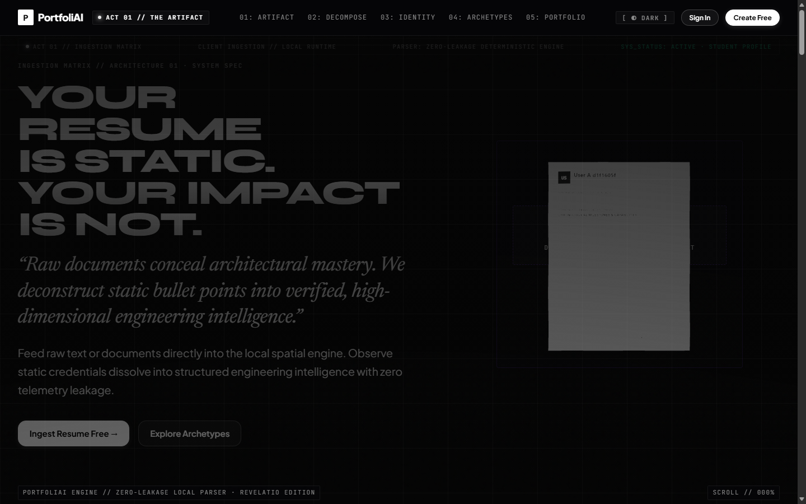
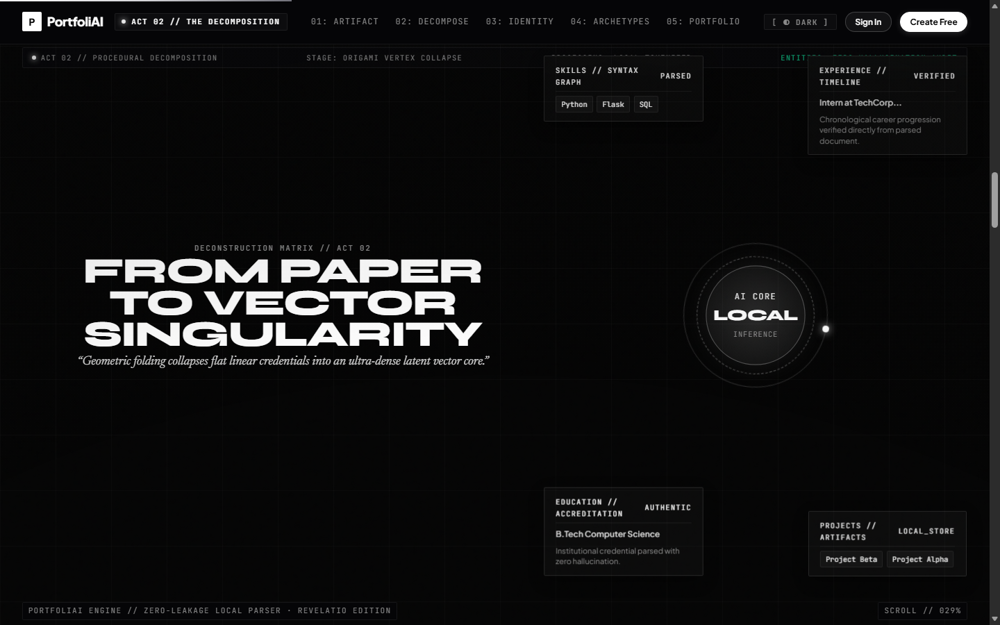
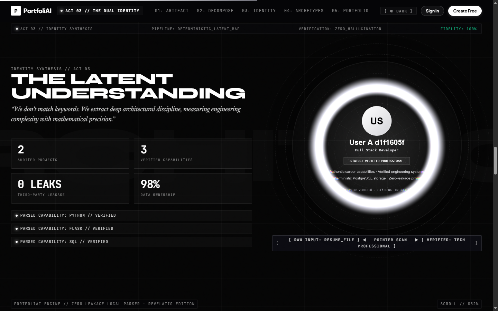
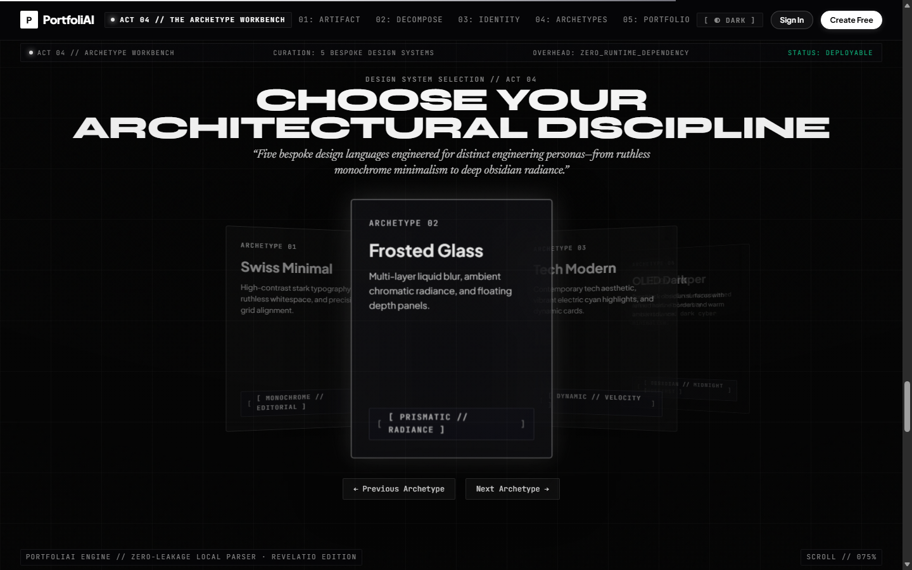
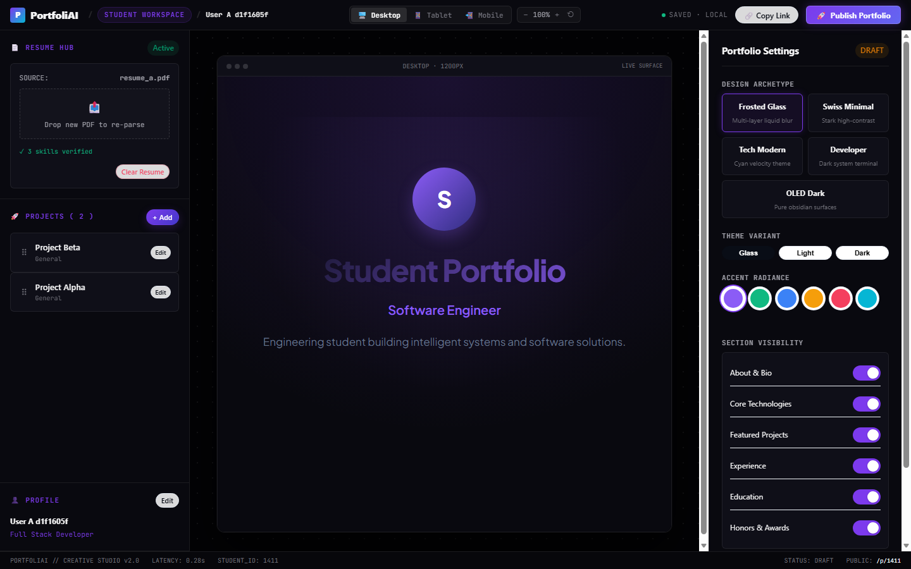
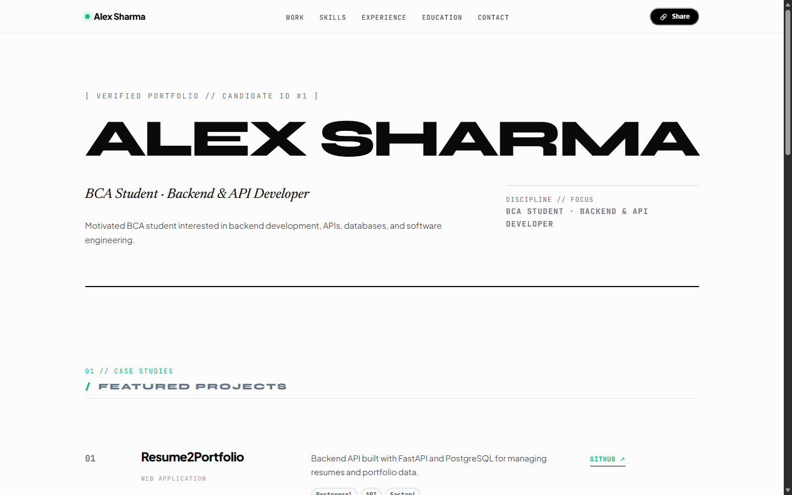
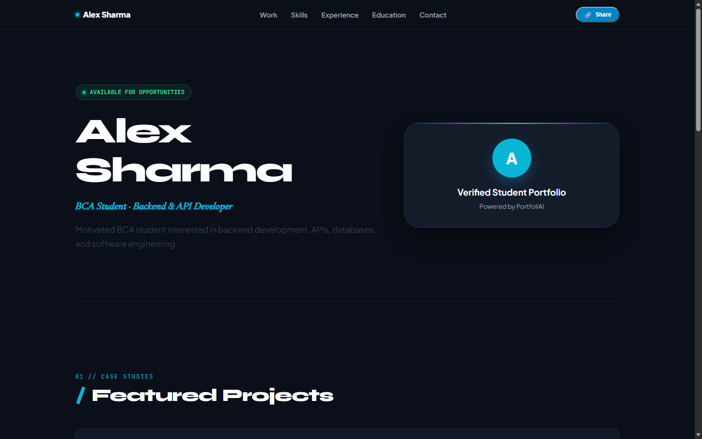
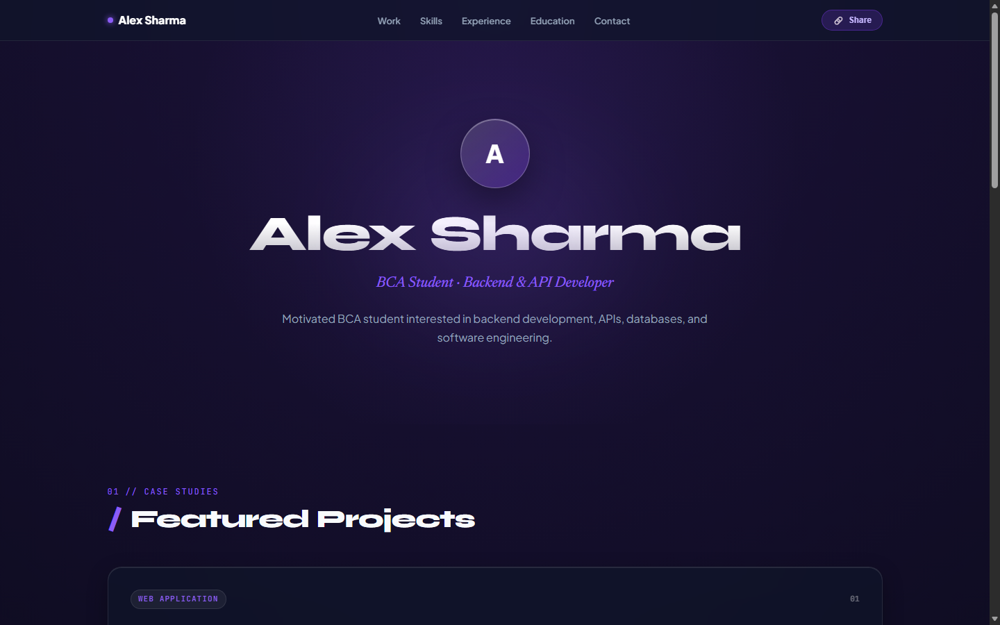
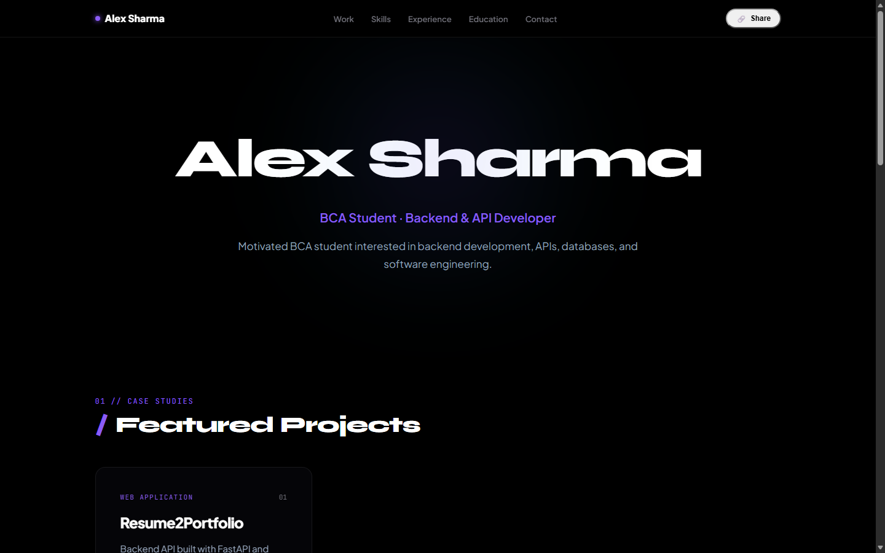

# PortfoliAI — AI-Powered Resume-to-Portfolio Platform

[](https://www.python.org/)
[](https://flask.palletsprojects.com/)
[](https://www.postgresql.org/)
[](https://threejs.org/)
[](https://greensock.com/)
[](https://docs.pytest.org/)
[](LICENSE)

An intelligent full-stack platform that transforms unformatted PDF resumes into structured candidate data and generates personalized, interactive, publication-ready portfolio websites with WebGL and cinematic scroll interactions.

---

## Overview

### The Problem
Engineers and students repeatedly face the friction of manual portfolio authoring. They already maintain up-to-date career data in resumes (contact info, work experience, projects, skills, education, and achievements), yet translating that data into a web portfolio requires hours of redundant copying, formatting, styling, and hosting configuration.

### The Solution
**PortfoliAI** automates the entire resume-to-portfolio lifecycle. Uploading a PDF resume triggers an extraction and parsing pipeline that cleanses raw document streams into relational candidate entities, persists them in PostgreSQL, and generates an interactive, multi-archetype portfolio. Students can customize their portfolio in an authenticated Creative Studio workspace and publish it via an isolated public URL (`/p/<student_id>`).

---

## Key Features

- **PDF Resume Ingestion**: Validates `%PDF-` magic-bytes, sanitizes filenames, and isolates uploads using cryptographic hashes.
- **Resilient Multi-Stage Parsing**: Extracts candidate name, email, phone, location, links (GitHub, LinkedIn), summary, skills, work experience, education, and projects via rule-based heuristics and regex fallbacks.
- **Structured Relational Persistence**: Stores parsed entities across normalized PostgreSQL tables (`users`, `students`, `projects`, `portfolio_settings`) with foreign key constraints, cascading deletes, and performance indexes.
- **AI Enrichment Architecture**: Provider-agnostic enrichment layer supporting a zero-dependency local heuristic engine, local Ollama models, or cloud LLMs (OpenAI) with graceful offline fallback.
- **Authenticated Studio Workspace**: Session and JWT-authenticated dashboard allowing candidates to edit profiles, manage projects, toggle visibility, and configure themes.
- **Five Distinct Portfolio Archetypes**:
  1. *Swiss Minimal*: Stark architectural paper typography and restrained editorial hierarchy.
  2. *Frosted Glass*: Translucent acrylic cards with liquid specular backdrops.
  3. *Tech Modern*: High-density bento grid with technical metadata badges.
  4. *CLI Developer*: Terminal-inspired carbon palette with monospaced telemetry.
  5. *OLED Dark*: Deep obsidian background with high-contrast hairline borders.
- **Interactive 3D / WebGL Experience**: Built with Three.js and custom GLSL vertex/fragment shaders featuring procedural paper folding, vector decomposition, and specular shader reveal waves.
- **GSAP & ScrollTrigger Motion Engine**: Continuous spatial camera choreography linking physical document stages to digital candidate identity.
- **Black / White Architectural Theme System**: Restrained monochrome design foundation featuring instant dark/light mode switching (`[ ◐ DARK ]` / `[ ☼ LIGHT ]`) persisted via `localStorage`.
- **Public Portfolio Publishing**: Unique shareable public routes (`/p/<student_id>`) dynamically rendered from PostgreSQL data.
- **Enterprise Security**: Scrypt password hashing, JWT HS256 tokens, strict SQL parameterization, and owner isolation.
- **Accessibility & Responsiveness**: Respects `prefers-reduced-motion` and adapts cleanly from mobile screens (390px) to ultra-wide displays (1440px+).
- **Automated Test Coverage**: 71 verified unit, regression, database persistence, and end-to-end integration tests.

---

## Architecture & Data Pipeline

```text
+------------------+      +-------------------+      +-------------------------------+
|  PDF Resume File | ---> |  Resume Processor | ---> | Structured Candidate Entities |
|  (Magic Bytes)   |      |  (SHA-256 Cache)  |      | (Contact, Exp, Skills, Projs) |
+------------------+      +-------------------+      +---------------+---------------+
                                                                     |
                                                                     v
+------------------+      +-------------------+      +-------------------------------+
| Public Portfolio | <--- | Interactive Stage | <--- |      PostgreSQL Database      |
|  (/p/<id>)       |      | (Three.js + GSAP) |      | (Normalized Relational Schema)|
+------------------+      +-------------------+      +---------------+---------------+
                                                                     |
                                                                     v
                                                     +-------------------------------+
                                                     |   Creative Studio Workspace   |
                                                     |    (Authenticated JWT / CRUD) |
                                                     +-------------------------------+
```

### Detailed Pipeline Flow
1. **Resume PDF Ingestion**: Client submits a PDF via multipart form upload. The backend validates magic bytes, verifies file extension constraints, computes a SHA-256 hash, and stores the file safely on disk.
2. **Resume Processor & Parsing**: PyPDF extracts raw text streams. The parser pipeline segments text blocks into contact information, technical competencies, work history, academic credentials, and project bullet points.
3. **Structured Candidate Data**: Raw strings are mapped into standardized typed dictionaries and validated against domain schemas.
4. **PostgreSQL Persistence**: Repositories (`UserRepository`, `StudentRepository`, `ProjectRepository`, `PortfolioRepository`) execute parameterized SQL transactions to persist candidate records.
5. **Portfolio Generator**: Synthesizes relational candidate records with theme preferences into a unified portfolio view model.
6. **Interactive Portfolio & Studio**: The candidate inspects their portfolio in the authenticated Creative Studio workspace, adjusting bio, headline, active archetype, and project ordering.
7. **Public Portfolio**: Published portfolio is served at `/p/<student_id>` for recruiters and hiring managers.

---

## Tech Stack

### Backend
- **Python 3.10+**: Core backend runtime.
- **Flask 3.1.3**: Microframework handling routing, templates, and RESTful API endpoints.
- **psycopg2-binary 2.9.12**: Robust PostgreSQL database adapter.
- **pypdf 6.16.2**: Low-level PDF stream extraction and byte inspection.
- **Werkzeug 3.1.8**: WSGI utilities and `scrypt` password hashing.
- **PyJWT 2.13.0**: Stateless HS256 authentication token issuance and verification.
- **python-dotenv 1.2.3**: Safe environment variable management.

### Database
- **PostgreSQL 14+**: Relational persistence engine with Foreign Key cascades, check constraints, and B-Tree indexes.

### Frontend & Motion
- **JavaScript (ES6+)**: Modular client-side architecture.
- **Three.js (r128)**: 3D scene graphs, custom geometries, directional studio lighting, and GLSL shaders.
- **GSAP & ScrollTrigger 3.12**: Scroll-linked timeline animations and spatial camera transitions.
- **CSS3 Modern**: CSS custom properties, glassmorphism, responsive fluid typography, and dark/light architectural themes.

### Testing & Tooling
- **pytest 9.1.1**: Test runner with database isolation and regression suites.
- **GitHub Actions**: Automated CI pipeline running PostgreSQL service containers and test suites.

---

## Security & Data Integrity

- **Stateless JWT Authentication**: Bearer tokens signed with HS256 with configurable expiration windows (`JWT_EXPIRATION_HOURS`).
- **Cryptographic Password Hashing**: Passwords hashed using Werkzeug's implementation of `scrypt` with unique salt per user.
- **Strict Ownership Isolation**: Database foreign keys tie projects and portfolio settings to the authenticated user ID, preventing multi-tenant data leakage.
- **Zero SQL Injection**: 100% of SQL queries use parameter placeholders (`%s`) via `psycopg2`; zero inline string interpolation.
- **Upload Hardening**: Enforces `%PDF-` header validation, 10 MB file size bounds (`MAX_CONTENT_LENGTH`), and filename sanitization.
- **Local-First Privacy**: The default AI enrichment engine runs entirely locally with zero telemetry or data transmission to external APIs. External LLMs (OpenAI/Ollama) are strictly opt-in.

---

## Screenshots Gallery

### Act 01 // The Physical Artifact (Landing Hero)
Floating tactile 3D resume rendered in an architectural obsidian void with directional studio lighting.


### Act 02 // Vector Singularity & Decomposition
Procedural vertex folding collapsing resume data into an orbital singularity core.


### Act 03 // Dual Identity Specular Reveal
Custom GLSL fragment shader wave revealing candidate engineering identity.


### Act 04 // Spatial Archetype Discipline
Five architectural portfolio archetypes displayed in a spatial carousel.


### Creative Studio Workspace
Authenticated workspace with real-time portfolio inspector and live configuration controls.


### Public Portfolio Archetypes (`/p/<student_id>`)

| Swiss Minimal (Architectural Paper) | Tech Modern (Bento Grid) |
| :---: | :---: |
|  |  |

| Frosted Glass (Liquid Blur) | OLED Dark (Pure Obsidian) |
| :---: | :---: |
|  |  |

---

## Project Structure

```text
student-portfolio/
├── .github/
│   └── workflows/
│       └── tests.yml              # GitHub Actions CI workflow (Python + PostgreSQL)
├── ai/
│   ├── base_provider.py           # Abstract base class for AI providers
│   ├── enrichment_service.py      # Provider orchestrator with fallback handling
│   ├── local_enricher.py          # Deterministic local NLP enrichment engine
│   ├── ollama_provider.py         # Local LLM integration (Ollama)
│   └── openai_provider.py         # Cloud LLM integration (OpenAI API)
├── docs/
│   └── screenshots/               # Verified authentic application screenshots
├── parsers/
│   ├── regex_parser.py            # Heuristic regex-based resume section parser
│   └── __init__.py
├── repositories/
│   ├── portfolio_repository.py    # Portfolio settings CRUD and archetype persistence
│   ├── project_repository.py      # Candidate projects CRUD operations
│   ├── student_repository.py      # Candidate profiles and skills persistence
│   └── user_repository.py         # User credentials and authentication records
├── static/
│   ├── css/
│   │   ├── immersive-core.css     # Base design tokens, B/W palette, HUD, and themes
│   │   ├── immersive-landing.css  # 5-act cinematic landing layout and components
│   │   ├── immersive-studio.css   # Creative Studio workspace styling
│   │   ├── portfolio-archetypes.css # 5 public portfolio archetype styles
│   │   └── workspace.css          # Workspace editor layout
│   └── js/
│       ├── engine/
│       │   ├── motion-engine.js   # GSAP & ScrollTrigger camera coordination
│       │   └── webgl-stage.js     # WebGL canvas lifecycle and renderer binding
│       ├── narrative/
│       │   └── landing-narrative.js # Act triggers, theme toggle, and audio/HUD controls
│       ├── three/
│       │   ├── scene-origami.js   # 3D floating resume, paper folding, and singularity
│       │   └── scene-identity.js  # Dual identity GLSL shader reveal
│       └── studio/
│           ├── studio-canvas.js   # Studio preview canvas
│           └── studio-inspector.js # Real-time settings inspector
├── templates/
│   ├── app.html                   # Cinematic landing page with perimeter HUD & WebGL stage
│   └── index.html                 # Workspace & public portfolio preview templates
├── config.py                      # Centralized environment configuration
├── main.py                        # Flask application entry point and API routes
├── resume_processor.py            # Ingestion pipeline, PDF parsing, and hashing
├── run_migration.py               # Database schema migration executor
├── schema.sql                     # PostgreSQL DDL tables, indexes, and constraints
├── security.py                    # JWT token creation, password hashing, and auth decorators
├── requirements.txt               # Locked Python dependencies
├── .env.example                   # Environment variable template (names only)
├── .gitignore                     # Production Git ignore rules
└── LICENSE                        # MIT License
```

---

## Installation & Local Setup

### 1. Prerequisites
- **Python**: 3.10, 3.11, or 3.14
- **PostgreSQL**: 14+ installed and running locally
- **Git**

### 2. Clone Repository
```bash
git clone <repository_url>
cd PortfoliAI
```

### 3. Setup Virtual Environment
```bash
# Create virtual environment
python -m venv venv

# Activate virtual environment
# Windows (PowerShell):
.\venv\Scripts\Activate.ps1
# Linux / macOS:
source venv/bin/activate
```

### 4. Install Dependencies
```bash
pip install --upgrade pip
pip install -r requirements.txt
```

### 5. Configure Environment Variables
Copy `.env.example` to `.env`:
```bash
cp .env.example .env
```
Edit `.env` with your local PostgreSQL credentials:
```env
FLASK_ENV=development
FLASK_DEBUG=true
SECRET_KEY=your-secure-dev-secret
JWT_SECRET_KEY=your-secure-jwt-secret
DB_HOST=localhost
DB_PORT=5432
DB_NAME=student_portfolio
DB_USER=postgres
DB_PASSWORD=your_postgres_password
AI_PROVIDER=local
```

### 6. Run Database Migrations
Initialize the PostgreSQL database schema and tables:
```bash
python run_migration.py
```

### 7. Start the Development Server
```bash
python main.py
```
Open your browser and navigate to:
```text
http://127.0.0.1:5000/
```

---

## Testing & Verification

The test suite covers database persistence, resume parsing, pipeline execution, authentication, JWT tokens, project management, and rate limiting.

### Run All Tests
```bash
python -m pytest
```

### Current Verified Test Result
```text
======================== 71 passed in 74.90s ========================
```
- Total Tests: **71 passed**
- Regressions: **0**
- Failures: **0**

### Individual Test Suites
```bash
# Database persistence and repository CRUD
pytest test_db_persistence.py

# Multi-stage parsing pipeline
pytest test_pipeline.py

# JWT authentication and security controls
pytest test_phase4.py

# Creative studio and archetype settings
pytest test_phase5.py

# Public portfolio generation and rendering
pytest test_phase6.py
```

---

## Live Demo & Video Walkthrough

- **Live Demo**: *[Deployment link pending]*
- **Video Walkthrough**: *[Demo video link pending]*

*(Links will be added upon deployment to production hosting).*

---

## Future Improvements

- **Multi-Column PDF Layout Parsing**: Extend the parser pipeline using spatial bounding-box clustering to handle complex non-standard multi-column resume layouts.
- **Production Cloud Deployment**: Containerize with Gunicorn and deploy via Docker to cloud infrastructure (AWS ECS, Render, or Fly.io).
- **Recruiter Engagement Analytics**: Privacy-first telemetry measuring archetype engagement, project clicks, and resume download conversions.
- **Custom Domain Mapping**: Allow candidates to link personal top-level domains directly to their published portfolio route.

---

## License

This project is licensed under the MIT License — see the [LICENSE](LICENSE) file for details.
